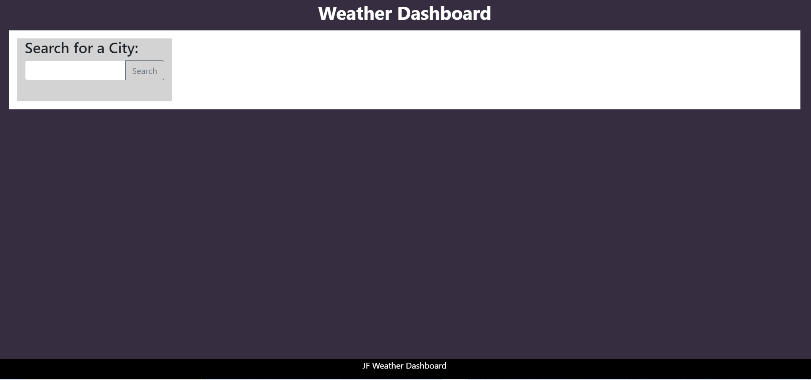

# JFWeatherDashboard
Purpose:
    The purpose of this app is to give the user the current weather and the 5 day forecast of whatever city they search for. The app leverages the OpenWeatherAPI, making two calls to retrieve the necessary data. Once a city is searched for, a button will be created underneath the search button that contains the city name of the search. If this newly created button is clicked again, the information for the city associated with that button will be searched for again. The current functionality and design of this app is at the basic stages. 
    
    To see how the app works, please follow this link for the deployed application: https://jerryforsberg.github.io/JFWeatherDashboard/

Technologies Used: 
    - HTML for basic structuring 
    - CSS and Bootstrap for styling 
    - Jquery and javascript to dynamically create elements and take information from the object returned from the API's.
    - OpenWeather API to obtain the weather information 

